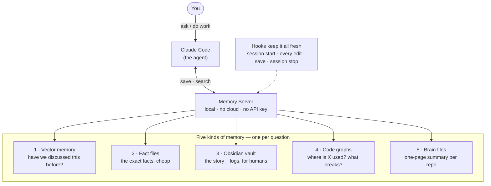

# Claude Code Memory Cache

[](LICENSE)
[](https://www.python.org)
[](https://claude.com/claude-code)

**Claude Code forgets everything the moment a session ends.** This gives it a memory that survives — so it remembers what you told it last week, and looks things up cheaply instead of re-reading your whole codebase to answer *"where is X used?"* Everything runs locally on your machine: no API key, no cloud.


*The optional [live memory graph](docs/VISUALIZER.md) (2D view shown; a full 3D mode with hologram effects is one click away), from one real installation after ~3 months of use. Every node is one of **your** memories — the graph starts empty and grows as your sessions save them, clustered by meaning and pulsing as sessions think. Measured results from the same installation: [docs/STATS.md](docs/STATS.md).*

> ⚠️ Unofficial. Not affiliated with Anthropic. "Claude" is a trademark of Anthropic; this is an independent community project.

## How it works

Claude Code talks to one small **Memory Server** on your machine using just two actions — **save a memory** and **search past memories**. The server keeps five kinds of memory, each good at a different question, and a set of **hooks** keeps them all fresh automatically.



## The five kinds of memory

| # | Kind | The question it answers | What it actually is |
|---|------|-------------------------|---------------------|
| 1 | **Vector memory** | *"Have we discussed something like this before?"* | A local search over past sessions by **meaning** — a paraphrase still finds the right note, and exact tokens like error strings match too. Uses a local database with built-in embeddings, no API key needed. |
| 2 | **Fact files** | *"What exactly did you tell me?"* | Plain-text notes, one fact per file, with a tiny always-loaded index (`MEMORY.md`). The full facts are read only when they're needed, so they cost nothing until then. |
| 3 | **Obsidian vault** | *"Show me the story."* | Human-readable session logs, per-project notes, and a running *lessons-learned* file — browsable by you, not just the agent. |
| 4 | **Code graphs** | *"Where is this used? What breaks if I change it?"* | A map of your codebase's structure, so Claude checks the map instead of re-reading every file. |
| 5 | **Brain files** | *"Give me the one-pager on this repo."* | A single `PROJECT_BRAIN.md` per project — stack, conventions, priorities — refreshed automatically as you work. |

The payoff: continuity across sessions, and far fewer tokens spent — see [docs/TOKEN_EFFICIENCY.md](docs/TOKEN_EFFICIENCY.md) for the techniques and [docs/STATS.md](docs/STATS.md) for real numbers. New terms (MCP, embedding, hook) are defined in [docs/ARCHITECTURE.md](docs/ARCHITECTURE.md#glossary).

## Optional: watch your memory

A [live graph of your memory](docs/VISUALIZER.md) — semantic clusters, a hologram mode, and nodes that pulse in real time as your sessions search and save. One command:

```bash
python visualizer/graph_server.py --open
```

## Quickstart

```bash
git clone https://github.com/jushayden/claude-code-memory-cache
cd claude-code-memory-cache
pip install -r requirements.txt
python install.py            # guided: deps check, config, snippets to merge, vault seeding
```

Or let your agent do it — paste [docs/AGENTIC_SETUP.md](docs/AGENTIC_SETUP.md) into Claude Code.

## What's in here

```
memory_server/   the Memory Server (layers 1–3): server.py, storage.py, hybrid.py, obsidian.py
scripts/         hook helpers (fingerprint_gate.py — skips graph rebuilds on non-structural edits)
config/          CLAUDE.md + settings.json (hooks) templates to merge into your setup
visualizer/      OPTIONAL live memory graph (docs/VISUALIZER.md)
docs/            architecture, setup, token efficiency, security, stats, visualizer
install.py       guided installer
```

## Docs

- **[Architecture](docs/ARCHITECTURE.md)** — the diagram, the five layers in plain English, the hooks, and a glossary
- **[Setup](docs/SETUP.md)** — manual install, step by step
- **[Agentic setup](docs/AGENTIC_SETUP.md)** — let your Claude install it
- **[Real numbers](docs/STATS.md)** — measured costs, savings, and an honest list of what turned out useless
- **[Token efficiency](docs/TOKEN_EFFICIENCY.md)** — the techniques that cut token use
- **[Visualizer](docs/VISUALIZER.md)** — the optional live memory graph
- **[Security](docs/SECURITY.md)** — scrub checklist before you publish your own setup

## Requirements

Python 3.10+, Node 20+, Claude Code, and (optional but recommended) Obsidian.

## License

MIT — see [LICENSE](LICENSE).
