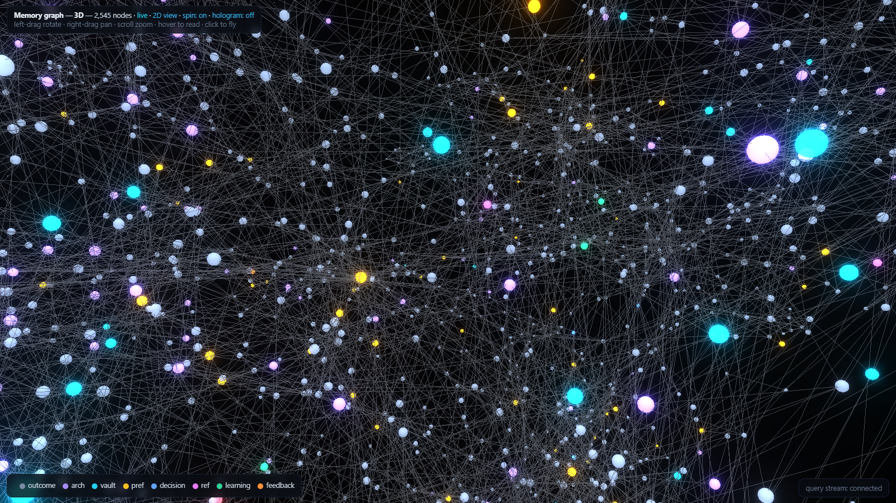

# Claude Code Memory Cache

[](LICENSE)
[](https://www.python.org)
[](https://claude.com/claude-code)

**Persistent, token-efficient memory for Claude Code.** Give the agent a memory that survives across sessions, projects, and machines — a "cache" for everything it should remember between runs, so it stops forgetting what you told it last week and stops re-reading your whole codebase to answer *"where is X used?"*


*The optional [live memory graph](docs/VISUALIZER.md) (2D view shown; a full 3D mode with hologram effects is one click away), from one real installation after ~3 months of use. Every node is one of **your** memories — the graph starts empty and grows as your sessions save them, clustered by meaning and pulsing as sessions think. Measured results from the same installation: [docs/STATS.md](docs/STATS.md).*

> ⚠️ Unofficial. Not affiliated with Anthropic. "Claude" is a trademark of Anthropic; this is an independent community project.

## What it is

Five cooperating memory layers, kept fresh automatically by hooks:

1. **Vector memory** — hybrid recall of past sessions: semantic search (ChromaDB, local, no API cost) fused with keyword BM25 per query, so exact tokens like error strings and env var names rank as well as paraphrases → [`memory_server/`](memory_server)
2. **File memory** — a compact `MEMORY.md` index + one-fact-per-file store, read on demand
3. **Obsidian vault** — session logs, per-project notes, a `Lessons` file, a cross-project `Brain Map`
4. **Code knowledge graphs** — `graphify` + `code-review-graph`, so Claude queries *structure* instead of grepping files
5. **Brain files** — a `PROJECT_BRAIN.md` per project, auto-refreshed

The result: continuity across sessions, and much lower token use (see [docs/TOKEN_EFFICIENCY.md](docs/TOKEN_EFFICIENCY.md)).

**Optional eye candy:** a [live 3D graph of your memory](docs/VISUALIZER.md) — semantic clusters, a hologram mode, and nodes that pulse in real time as your sessions search and save. One command: `python visualizer/graph_server.py --open`.

## Quickstart

```bash
git clone https://github.com/jushayden/claude-code-memory-cache
cd claude-code-memory-cache
pip install -r requirements.txt
python install.py            # guided: deps check, config, snippets to merge, vault seeding
```

Or let your agent do it — paste [docs/AGENTIC_SETUP.md](docs/AGENTIC_SETUP.md) into Claude Code.

## What's in here

```
memory_server/   the memory MCP server (ChromaDB + Obsidian): server.py, storage.py, obsidian.py
visualizer/      OPTIONAL live 3D memory graph (docs/VISUALIZER.md)
scripts/         hook helpers (fingerprint_gate.py — skips graph rebuilds on non-structural edits)
config/          CLAUDE.md + settings.json (hooks) templates
docs/            architecture, setup, token efficiency, security, stats, visualizer
install.py       guided installer
```

## Docs

- **[Architecture](docs/ARCHITECTURE.md)** — the 5 layers + hooks + data flow
- **[Setup](docs/SETUP.md)** — manual install (step by step)
- **[Agentic setup](docs/AGENTIC_SETUP.md)** — let your Claude install it
- **[Real numbers](docs/STATS.md)** — measured costs, savings, and the honest list of what was useless
- **[Token efficiency](docs/TOKEN_EFFICIENCY.md)** — the 7 techniques that cut token use
- **[Visualizer](docs/VISUALIZER.md)** — the optional live 3D memory graph (pulses on real activity)
- **[Security](docs/SECURITY.md)** — scrub checklist before you publish your own setup

## Requirements

Python 3.10+, Node 20+, Claude Code, and (optional but recommended) Obsidian.

## License

MIT — see [LICENSE](LICENSE).
