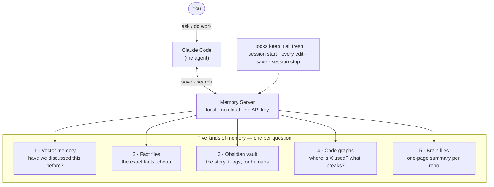

# Architecture

Claude Code Memory Cache is **five kinds of memory** plus the **automation that keeps them fresh**. Each kind answers a different question; together they give the agent continuity between sessions and cheap context during them.



---

## The five kinds of memory

### 1. Vector memory — *"have we discussed something like this before?"*
A local database of past-session snippets you can search by **meaning**, not exact words. It lives behind the **Memory Server** ([`memory_server/server.py`](../memory_server/server.py)) and uses built-in embeddings, so it's free and fully local — no API key.
- **Save:** `memory_save` at meaningful moments; a `Stop` hook can auto-log a finished session.
- **Search:** `memory_search` — one lookup across every past session. Results are ranked by a mix of meaning (embeddings) **and** exact keywords (BM25), so a paraphrase *and* an exact error string both find the right note.

### 2. Fact files — *"the specific facts, cheaply"*
A per-project folder of one-fact-per-file notes with a compact index:
```
<project>/memory/
  MEMORY.md              # one line per fact — the ALWAYS-loaded index
  user_<slug>.md         # who the user is / their preferences
  feedback_<slug>.md     # corrections + how-to-apply rules
  project_<slug>.md      # ongoing work, constraints
  reference_<slug>.md    # external pointers (links, dashboards)
```
Only `MEMORY.md` rides in context every session. Full fact files are read **on demand**, so they cost nothing until they're actually needed.

### 3. Obsidian vault — *"the durable, human-readable narrative"*
Session logs (`Claude Sessions/`), per-project notes (`Projects/<Name>/`), a `Lessons for Claude.md` (mistakes → rules), a cross-project `Brain Map.md`, and `Home.md` / `About Me.md`. This is the layer **you** browse, not just the agent.

### 4. Code graphs — *"where is X used / what breaks if I change Y?"*
A map of your codebase's structure so Claude reads **structure, not files**. Two tools build it: `graphify` (writes `graphify-out/` + a `GRAPH_REPORT.md`) and `code-review-graph` (an MCP with `query_graph`, `get_impact_radius`, `semantic_search_nodes`, `detect_changes`). Hooks rebuild both after edits, so the map stays current.

### 5. Brain files — *"the single source of truth per project"*
`PROJECT_BRAIN.md` (per repo: stack, conventions, priorities, recently shipped — some sections auto-refresh on edit) and the cross-project `Brain Map.md` dashboard. Read this first in a new session to get oriented fast.

---

## The automation (hooks)

Hooks are small commands Claude Code runs automatically at certain moments, so nothing has to be updated by hand.

| Hook event | Runs | Purpose |
|------------|------|---------|
| `PostToolUse` (Edit/Write/Bash) | rebuild graphs · refresh the brain file · re-embed the vault | keep everything current after each change |
| `SessionStart` | graph status · roll up recent sessions | orient at the start of a session |
| `PreToolUse` (Glob/Grep) | inject a "read the graph first" reminder | steer toward the cheap path |
| `Stop` | log the finished session and file it into the vault | capture the session |

---

## Where does X go? (decision guide)

| You learned… | Put it in… |
|--------------|------------|
| A durable fact about the user/project | **Fact files** (`memory/` + a `MEMORY.md` line) |
| A mistake + the rule to avoid repeating it | **`Lessons for Claude.md`** (vault) |
| A searchable summary of a session | **Vector memory** (`memory_save`) + a session log |
| Stack/convention/priority for a repo | **`PROJECT_BRAIN.md`** |
| A note for humans to browse | **Obsidian vault** (`Projects/…`) |
| Anything derivable from code or git history | **Nowhere** — don't duplicate it |

---

## Data flow (one session, start to finish)

1. **Session start** → hooks report graph status and roll up recent sessions; the agent runs its startup routine.
2. **During work** → it queries the code graph before grepping, reads `memory/` facts on demand, and saves decisions plus a session log.
3. **On each edit** → `PostToolUse` hooks rebuild the graph, refresh the brain file, and re-embed the vault.
4. **Session stop** → the finished session is auto-logged and filed into the vault.

The standing context stays lean; everything heavy is pulled just-in-time.

---

## Glossary

Three terms show up throughout:

- **MCP (Model Context Protocol)** — the standard way Claude Code plugs into an external tool. The Memory Server is an MCP server, which is how Claude gets the `memory_save` / `memory_search` actions.
- **Embedding** — a way of turning text into numbers that capture its *meaning*, so two notes that say the same thing in different words land near each other. This is what makes "search by meaning" (layer 1) possible.
- **Hook** — a command Claude Code runs automatically at a set moment (a session starting, a file being edited, a session ending). Hooks are what keep all five layers fresh, so you never update them by hand.
